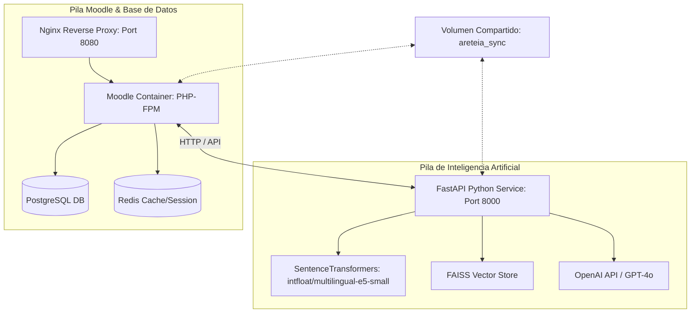
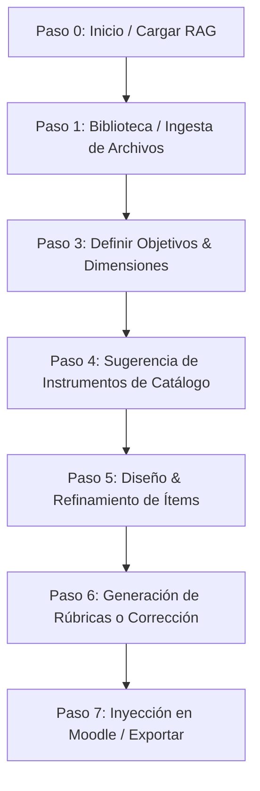

# AreteIA — Plataforma de Asistencia Pedagógica Basada en IA y RAG

Presentación: https://drive.google.com/file/d/1H2txzKzobje5fka-ZP_q1HMDnrc1KKIT/view?usp=drive_link

¿Qué es AretéIA?

AretéIA es una plataforma de asistencia pedagógica basada en Inteligencia Artificial diseñada para acompañar a los equipos docentes en la construcción de instrumentos de evaluación alineados con los objetivos de aprendizaje de sus asignaturas.

Se integra con Moodle mediante un plugin institucional y utiliza técnicas de Recuperación Aumentada por Generación (RAG, Retrieval-Augmented Generation) para analizar los materiales disponibles en el aula virtual y generar propuestas contextualizadas.

Su objetivo es apoyar la planificación y diseño de evaluaciones, promoviendo la coherencia entre contenidos, objetivos de aprendizaje y estrategias de evaluación.

Funcionalidades disponibles en el piloto

La versión actualmente disponible para pilotado permite:

Analizar materiales presentes en un aula Moodle en formato PDF.
Construir una base de conocimiento a partir de esos materiales.
Asistir en la creación de instrumentos de evaluación alineadas con los contenidos trabajados, y con los objetivos y criterios especificados por los docentes, incorporando materiales sobre evaluación elaborados específicamente.

Las respuestas generadas se fundamentan en:

Los contenidos reales disponibles en el aula virtual.
Materiales pedagógicos incorporados por la institución.
Los criterios configurados para el diseño de instrumentos de evaluación.


Arquitectura general

AretéIA está compuesto por dos componentes principales:

Plugin Moodle

Se instala como un plugin local de Moodle.

Sus responsabilidades incluyen:

Proporcionar la interfaz de usuario.
Gestionar permisos y acceso desde Moodle.
Recuperar información del curso.
Enviar solicitudes al servicio de IA.
Servicio de Inteligencia Artificial

Se ejecuta como un servicio independiente desarrollado en Python (FastAPI).

Sus responsabilidades incluyen:

Procesar documentos.
Generar embeddings.
Construir y consultar índices semánticos.
Ejecutar búsquedas RAG.
Interactuar con el modelo de lenguaje configurado.

La comunicación entre Moodle y el servicio de IA se realiza mediante APIs internas.

Requerimientos de infraestructura
Plataforma educativa
Moodle operativo.
Conectividad
Acceso a red durante la utilización del sistema.
Conectividad entre Moodle y el servicio de IA.
Conectividad saliente hacia el proveedor del modelo de lenguaje utilizado.
Servicio de IA
Docker o Docker Compose.
Sistema operativo Linux.
Recursos recomendados para pilotado
16 vCPU.
16 GB de RAM.
50 GB de almacenamiento disponible.

Los requerimientos pueden variar según:

Cantidad de usuarios concurrentes.
Volumen de documentos procesados.
Modelo de lenguaje utilizado.
Estrategia de indexación y persistencia de datos.
Modelo de lenguaje

Consideraciones de implementación

AretéIA puede instalarse:

Sobre un Moodle institucional existente.
Como parte de una instalación nueva de Moodle.

La arquitectura desacoplada entre Moodle y el servicio de IA permite actualizar o reemplazar componentes de forma independiente y facilita futuras integraciones con distintos proveedores de modelos de lenguaje.

AreteIA es una plataforma educativa de última generación que se integra en **Moodle** como un bloque local (`local/areteia`). Su propósito es asistir a los equipos docentes en el diseño, estructuración y alineación pedagógica de sus instrumentos de evaluación (tareas, cuestionarios y foros de debate) utilizando técnicas avanzadas de **RAG (Retrieval-Augmented Generation)** y LLMs (Modelos de Lenguaje de Gran Escala).

El sistema garantiza la **alineación constructiva**: las evaluaciones generadas se fundamentan estrictamente en el contenido real cargado en el aula virtual y siguen las directrices pedagógicas e institucionales definidas por la institución.

---

## Modos de deploy

El sistema soporta tres escenarios de instalación:

| Modo | Cuándo usarlo |
|------|---------------|
| **A. Docker all-in-one** | Instalación nueva, dev local, servidor sin Moodle previo |
| **B. Docker split** | Cuando Moodle y el servicio de IA se gestionan por separado |
| **C. VPS / bare-metal** | Moodle ya instalado en el servidor; solo el servicio de IA usa Docker |

## Requisitos

### Para modos A y B (Docker)
- Docker Engine 20.10+
- Docker Compose v2
- 4 GB RAM mínimo
- 20 GB de disco libre

### Para modo C (VPS / bare-metal)
- Moodle operativo (versión 4.5+)
- Docker Engine (solo para el servicio de IA)
- Python 3.11+
- `git` instalado en el servidor

## Instalación

### Opción A: Docker all-in-one

Todo el stack (Moodle + PostgreSQL + Redis + Nginx + servicio de IA) en un único `docker-compose.yml`.

```bash
# 1. Clonar el repositorio
git clone https://github.com/brubrubru-96/AreteIA.git
cd AreteIA

# 2. Configurar variables de entorno
cp .env.example .env
nano .env   # Completar con tus valores
# Asegurarse de que COMPOSE_FILE=docker-compose.yml esté activo

# 3. Crear volúmenes y directorios
docker volume create areteia_db_data
docker volume create areteia_redis_data
docker volume create areteia_moodle_core
mkdir -p moodledata data/sync
chmod 777 moodledata

# 4. Levantar todo
docker compose up -d --build

# 5. Instalar Moodle (primera vez, esperar ~20 seg a que la DB arranque)
docker compose exec moodle \
    php /var/www/html/admin/cli/install_database.php \
    --lang=en \
    --adminuser=admin \
    --adminpass=password \
    --adminemail=admin@example.com \
    --fullname="AreteIA Moodle" \
    --shortname="AreteIA" \
    --agree-license
```

---

### Opción B: Docker split (Moodle y servicio de IA por separado)

Útil cuando se quiere gestionar cada componente de forma independiente.

```bash
# 1. Clonar el repositorio
git clone https://github.com/brubrubru-96/AreteIA.git
cd AreteIA

# 2. Configurar variables de entorno
cp .env.example .env
nano .env   # Activar: COMPOSE_FILE=docker-compose.moodle.yml:docker-compose.python.yml

# 3. Crear volúmenes y directorios
docker volume create areteia_db_data
docker volume create areteia_redis_data
docker volume create areteia_moodle_core
mkdir -p moodledata data/sync
chmod 777 moodledata

# 4. Levantar Moodle
docker compose -f docker-compose.moodle.yml up -d --build

# 5. Instalar Moodle (primera vez, esperar ~20 seg a que la DB arranque)
docker compose -f docker-compose.moodle.yml exec moodle \
    php /var/www/html/admin/cli/install_database.php \
    --lang=en \
    --adminuser=admin \
    --adminpass=password \
    --adminemail=admin@example.com \
    --fullname="AreteIA Moodle" \
    --shortname="AreteIA" \
    --agree-license

# 6. Levantar el servicio de IA
docker compose -f docker-compose.python.yml up -d --build
```

---

### Opción C: VPS / bare-metal (Moodle nativo + servicio de IA en Docker)

Para servidores donde Moodle ya está instalado y corriendo de forma nativa. Solo el servicio de IA usa Docker.

**Primer deploy:**
```bash
# En el servidor
git clone https://github.com/brubrubru-96/AreteIA.git /root/areteia
cd /root/areteia
cp .env.example .env
nano .env   # COMPOSE_FILE no es necesario en este modo

# Levantar solo el servicio de IA
docker compose -f docker-compose.python.yml up -d --build

# Instalar el plugin en Moodle: copiar local/areteia/ al webroot de Moodle
# y entrar a Administración del sitio → Notificaciones para correr el upgrade
```

**Actualizaciones (desde el servidor):**
```bash
# Deploy de una rama específica (hace git pull, copia plugin, purga caché,
# reinicia PHP-FPM y el servicio de IA automáticamente)
bash /root/areteia/scripts/deploy-vps.sh [nombre-de-rama]

# Ejemplo:
bash /root/areteia/scripts/deploy-vps.sh main
bash /root/areteia/scripts/deploy-vps.sh feat-metricas
```

> **Nota**: después de un deploy que incluya cambios en `db/upgrade.php` (nuevas tablas o campos), entrar a **Administración del sitio → Notificaciones** en Moodle para aplicar la migración de base de datos.

## Configuración

Toda la configuración se maneja a través del archivo `.env` (no se sube al repositorio).

### Variables principales

| Variable | Descripción | Ejemplo |
|----------|-------------|---------|
| `MOODLE_URL` | URL pública de Moodle | `https://mi-servidor.com` |
| `DB_PASS` | Contraseña de PostgreSQL | (cambiar obligatoriamente) |
| `MOODLE_ADMIN_PASS` | Contraseña del admin de Moodle | (cambiar obligatoriamente) |
| `HF_TOKEN` | Token de HuggingFace | `hf_...` |
| `DASHSCOPE_API_KEY` | API Key de DashScope (Qwen) | `sk-...` |
| `NGINX_PORT` | Puerto del servidor web | `8080` (default), `80` para producción |

### Proxy (opcional)

Si el servidor está detrás de un proxy corporativo:

```bash
# En .env
HTTP_PROXY=http://tu-proxy:puerto
HTTPS_PROXY=http://tu-proxy:puerto
```

También configurar el proxy del Docker daemon para poder hacer pull de imágenes:

```bash
sudo mkdir -p /etc/systemd/system/docker.service.d
sudo tee /etc/systemd/system/docker.service.d/proxy.conf << 'EOF'
[Service]
Environment="HTTP_PROXY=http://tu-proxy:puerto"
Environment="HTTPS_PROXY=http://tu-proxy:puerto"
Environment="NO_PROXY=localhost,127.0.0.1"
EOF
sudo systemctl daemon-reload
sudo systemctl restart docker
```

### SSL / Reverse Proxy

Si Moodle está detrás de un reverse proxy con HTTPS, el `entrypoint.sh` detecta automáticamente el header `X-Forwarded-Proto` y activa `sslproxy`. Solo asegurate de que `MOODLE_URL` comience con `https://`.

## Estructura del proyecto

```
areteia/
├── docker-compose.yml          # Stack unificado (Opción A: all-in-one)
├── docker-compose.moodle.yml   # Moodle + PostgreSQL + Redis + Nginx (Opción B)
├── docker-compose.python.yml   # Solo servicio Python RAG (Opción B y C)
├── Dockerfile                  # Imagen de Moodle (PHP 8.1 + extensiones)
├── entrypoint.sh               # Genera config.php y ajusta permisos
├── scripts/
│   └── deploy-vps.sh           # Script de deploy automatizado para VPS (Opción C)
├── conf/
│   ├── nginx.conf              # Configuración de Nginx
│   └── moodle.ini              # Configuración de PHP
├── areteia_ai/                 # Servicio de IA
│   ├── Dockerfile
│   ├── main.py                 # FastAPI app
│   ├── llm.py                  # Integración con LLMs
│   ├── schemas.py              # Modelos Pydantic
│   ├── requirements.txt
│   ├── brain/                  # Lógica de procesamiento
│   └── rag/                    # Motor RAG (FAISS + embeddings)
├── local/areteia/              # Plugin de Moodle
│   ├── version.php
│   ├── index.php
│   ├── report.php              # Página de reportes de actividad
│   ├── lib.php
│   ├── classes/                # Clases PHP del plugin
│   ├── db/                     # Esquema y migraciones de BD
│   ├── lang/                   # Traducciones
│   └── styles.css
├── .env.example                # Template de configuración
└── .gitignore
```

---

## 1. Arquitectura de Servicios del Sistema

La arquitectura está completamente contenedorizada mediante **Docker Compose**, dividida en dos pilas de servicios interconectadas:



### Componentes Clave:
1. **Petición del Usuario (Moodle UI):** El docente interactúa con la interfaz por pestañas en Moodle (`step_renderer.php`). Las solicitudes se envían al backend de Moodle.
2. **Cliente RAG (`rag_client.php`):** Moodle se comunica con el servicio de IA a través de llamadas HTTP de tipo REST hacia el contenedor `python_rag`.
3. **Servicio Python RAG (FastAPI):** Expone endpoints como `/ingest`, `/search`, `/generate` y `/status`. Controla la extracción de texto, vectorización y generación mediante LLM.
4. **Almacenamiento e Ingesta:** Los archivos seleccionados por el docente son extraídos del sistema de archivos de Moodle hacia el volumen compartido `/areteia_sync`, donde el servicio RAG los procesa.

---

## 2. El Rol de la IA: Embeddings, FAISS y RAG

El flujo RAG asegura que las evaluaciones no sufran de alucinaciones y contengan extractos textuales precisos de las lecturas y materiales del curso.

### A. ¿Qué son los Embeddings y Cuándo se Usan?
Un **Embedding** es una representación numérica (vector de dimensión 384 en este caso) de un fragmento de texto. Captura el significado semántico del texto: oraciones con significados similares quedan ubicadas cerca en el espacio vectorial.

*   **Durante la Ingesta (Construcción de la Biblioteca):** Los archivos `.pdf`, `.docx` y `.pptx` del curso se procesan. Cada archivo se divide en fragmentos mediante un `RecursiveCharacterTextSplitter` (tamaño de fragmento de **1000 caracteres**, solapamiento de **250**). Cada fragmento se convierte en un vector de embeddings utilizando el modelo **`intfloat/multilingual-e5-small`**.
*   **Durante la Búsqueda (Recuperación semántica):** Cuando el docente define los objetivos de aprendizaje (en texto libre), el sistema convierte esta consulta en un vector de embeddings. Se realiza una búsqueda vectorial para encontrar los fragmentos de documentos del curso semánticamente más relevantes para evaluar dicho objetivo.

> [!IMPORTANT]
> **Convención de Prefijos de E5:** El modelo de embeddings multilingüe E5 requiere el uso de prefijos específicos para optimizar la calidad de la búsqueda. Los fragmentos de documentos del curso se indexan con el prefijo `passage: `, mientras que las consultas de búsqueda se vectorizan usando el prefijo `query: `.

### B. ¿Para qué se usa FAISS?
**FAISS (Facebook AI Similarity Search)** es una librería de alto rendimiento para la búsqueda eficiente de similitudes en espacios vectoriales densos.
*   Actúa como nuestra base de datos vectorial local indexada por curso.
*   En lugar de comparar linealmente la consulta del usuario con miles de fragmentos de texto (lo cual sería muy lento), FAISS realiza operaciones de álgebra lineal optimizadas en CPU (limitadas a 8 hilos en este entorno para evitar saturación del host) para encontrar instantáneamente los fragmentos más cercanos mediante distancia coseno normalizada L2.
*   El índice FAISS resultante se guarda físicamente en disco (`index.faiss`) junto con un archivo serializado de metadatos (`metadata.pkl`) dentro del directorio del curso.

### C. Mapeo Pedagógico de Similitud
La similitud coseno de los embeddings de E5 tiende a concentrarse en un rango estrecho (generalmente entre `0.80` y `0.95`). Para hacer este valor intuitivo para un docente humano, el sistema implementa una función de mapeo estadístico (`map_score_pedagogical` en `search.py`):

*   Similitud $\ge 0.90$ $\rightarrow$ Escala de $85\%$ a $100\%$
*   Similitud entre $0.84$ y $0.90$ $\rightarrow$ Escala de $50\%$ a $85\%$
*   Similitud entre $0.80$ y $0.84$ $\rightarrow$ Escala de $5\%$ a $50\%$
*   Similitud $< 0.80$ $\rightarrow$ Se descarta el fragmento (debajo del umbral por defecto de 0.80).

---

## 3. Flujo Paso a Paso de AreteIA

La creación de recursos sigue un pipeline secuencial de 8 pasos en la interfaz de Moodle:



*   **Paso 0 - Carga RAG:** Detecta si existe un índice FAISS para el curso actual. Si no existe, invita a crearlo.
*   **Paso 1 - Crear Biblioteca:** El docente selecciona cuáles de los archivos del curso (extraídos de los recursos de Moodle) formarán la base documental del asistente de IA. Al presionar "Generar Biblioteca", se ejecuta el pipeline RAG y se crea el índice FAISS.
*   **Paso 3 - Configurar Evaluación:** El docente define las dimensiones pedagógicas:
    *   **D1 (Contenidos):** Temas específicos a evaluar.
    *   **D2 (Objetivos):** Declaraciones de aprendizaje y su nivel según la Taxonomía de Bloom.
    *   **D3 (Función):** Diagnóstica, Formativa o Sumativa.
    *   **D4 (Modalidad):** Presencial, Híbrida o A distancia.
*   **Paso 4 - Propuesta de Instrumentos:** La IA sugiere exactamente 3 instrumentos adecuados del catálogo maestro (por ejemplo, *Estudio de casos*, *Debate*, *Cuestionario*, *Ensayo*). El docente elige uno de ellos.
*   **Paso 5 - Diseñar Evaluación:** La IA redacta los ítems específicos de la evaluación (preguntas, consignas, rúbricas de partida) extrayendo el contenido clave mediante RAG. El docente puede ajustar ítems individuales o dar feedback global a la IA.
*   **Paso 6 - Instrumentos de Corrección:** Basado en la tabla de encaje pedagógico, se selecciona y genera el instrumento de corrección correspondiente (Rúbrica analítica, Escala de valoración, Lista de cotejo o Clave de respuestas).
*   **Paso 7 - Inyección a Moodle:** Se elige la sección del curso de Moodle y se exporta el recurso final de forma nativa e integrada.

---

## 4. Rutas Críticas para los 3 Recursos de Moodle

Una vez finalizado el diseño pedagógico con la IA, el sistema mapea el instrumento seleccionado a una de las tres actividades nativas de Moodle:

### 📋 A. Ruta 1: Tarea (Assignment)
Se activa para instrumentos de producción libre o evidencias complejas (ej: *Ensayo*, *Análisis de casos*, *Portafolio*, *Proyecto de investigación*).

1.  **Paso 4:** El docente selecciona un instrumento mapeado a tipo `assign` en `encaje_table.php`.
2.  **Paso 5:** La IA genera las consignas del instrumento, las directrices de entrega y los objetivos cubiertos.
3.  **Paso 6:** La IA genera una **Rúbrica Analítica** detallada (criterios, niveles y descriptores de logro) o una **Escala de valoración**.
4.  **Paso 7 (Inyección):** El backend llama a `data_provider::create_assign_activity()`.
    *   Crea una instancia de la actividad `assign` de Moodle en la sección elegida del curso.
    *   Genera una descripción en formato HTML/Markdown enriquecido que incluye: la descripción del instrumento, cada una de las consignas generadas por la IA con sus objetivos asociados, y la visualización de la Rúbrica de corrección para que los estudiantes conozcan los criterios de antemano.

### 📝 B. Ruta 2: Cuestionario (Quiz)
Se activa para instrumentos cerrados o pruebas mixtas (ej: *Cuestionario*, *Escape room*, *Prueba mixta*).

1.  **Paso 4:** El docente selecciona un instrumento mapeado a tipo `quiz` en `encaje_table.php`.
2.  **Paso 5:** La IA genera una batería de ítems estructurados. Los tipos permitidos son:
    *   *Opción múltiple* (`multichoice`): Enunciado, distractores y el índice correcto.
    *   *Verdadero/Falso* (`truefalse`): Enunciado y valor booleano correcto.
    *   *Respuesta breve* (`shortanswer`): Enunciado y la respuesta esperada.
    *   *Numérica* (`numerical`): Enunciado y el valor numérico correcto.
    *   *Emparejamiento* (`match`): Lista de pares premisa-respuesta.
    *   *Poner en orden* (`ordering`): Lista de ítems en el orden correcto.
    *   *Texto lacunar* (`gapselect`): Enunciado con un hueco y la respuesta esperada.
3.  **Paso 6:** La IA genera una **Clave de corrección** detallada.
4.  **Paso 7 (Inyección):** El backend llama a `data_provider::create_quiz_activity()`.
    *   Crea la actividad `quiz` de Moodle en la sección elegida del curso.
    *   Itera sobre cada ítem del JSON y llama a la API interna de Moodle (`question_bank`) para crear la pregunta nativa correspondiente (no texto plano, sino preguntas interactivas reales).
    *   Añade todas las preguntas creadas al quiz.

### 💬 C. Ruta 3: Foro (Forum)
Se activa para actividades de discusión y co-evaluación (ej: *Debate*, *Evaluación oral*).

1.  **Paso 4:** El docente selecciona un instrumento mapeado a tipo `forum` en `encaje_table.php`.
2.  **Paso 5:** La IA diseña el tema del debate, las preguntas detonantes basadas en el material del curso y las reglas de participación e interacción entre estudiantes.
3.  **Paso 6:** La IA genera una **Lista de cotejo** o **Escala de valoración** para calificar la calidad de las participaciones.
4.  **Paso 7 (Inyección):** El backend llama a `data_provider::create_forum_activity()`.
    *   Crea la actividad `forum` de Moodle en la sección del curso.
    *   Configura la descripción del foro detallando el disparador del debate redactado por la IA, las pautas de netiqueta, los plazos mínimos, la rúbrica/escala de evaluación y los objetivos pedagógicos esperados.

---

## 5. Detalles de los Prompts y Rol de la IA por Paso

Los prompts se configuran en `llm.py` y se estructuran para devolver respuestas estrictamente formateadas en **JSON** para su fácil procesamiento por el backend PHP.

### 🔹 Paso 4: Propuesta de Sugerencias (`get_suggestions_prompt`)
*   **Rol de la IA:** Analizar el contexto semántico del curso y los objetivos definidos para sugerir 3 instrumentos del catálogo maestro que maximicen la alineación constructiva.
*   **Prompt:**
    ```text
    Tu tarea es proponer 3 instrumentos de evaluación que estén perfectamente alineados con los objetivos y el contexto del curso.

    ### 1. CONTEXTO GENERAL DEL CURSO:
    {course_summary}

    ### 2. OBJETIVOS DE APRENDIZAJE (Taxonomía de Bloom):
    {objective}

    ### 3. DIMENSIONES PEDAGÓGICAS DEFINIDAS:
    {dimensions}

    ### 4. MATERIALES DEL CURSO, DIRECTRICES Y CATÁLOGO DE INSTRUMENTOS:
    {full_context}
    {feedback_sect}

    ### INSTRUCCIONES CRÍTICAS:
    1. Debes elegir exactamente 3 instrumentos de la "LISTA DE INSTRUMENTOS DISPONIBLES" proporcionada arriba. El valor de "name" en tu respuesta debe ser el NOMBRE EXACTO del catálogo.
    2. Basándote en el contexto y las directrices, justifica detalladamente por qué cada uno de estos 3 instrumentos es la mejor opción.
    3. Cada propuesta debe estar justificada pedagógicamente, mencionando cómo se alinea con el nivel de Bloom y qué directriz institucional cumple.
    4. Responde UNICAMENTE en formato JSON:
    {
      "suggestions": [
        {
          "name": "Nombre exacto del catálogo",
          "why": "Justificación detallada citando el contexto y la directriz aplicada.",
          "lim": "Limitación técnica del instrumento."
        }
      ]
    }
    ```

### 🔹 Paso 5: Diseño del Instrumento (`get_design_prompt`)
*   **Rol de la IA:** Redactar y estructurar las preguntas/consignas de evaluación basándose en extractos específicos recuperados de los materiales del curso mediante RAG. Soporta refinamiento parcial (regeneración selectiva de un ítem si el docente lo solicita).
*   **Prompt:**
    ```text
    ### TAREA A REALIZAR:
    Diseñar una batería de {num_items} ítems de evaluación para un instrumento de tipo: {chosen_instrument}.

    **Descripción del instrumento:**
    {instrument_desc}

    ### OBJETIVOS DE LA EVALUACIÓN (CON EXTRACTOS Y REFERENCIAS):
    {structured_materials}

    ### TIPOS DE PREGUNTAS PERMITIDOS (DEBES ELEGIR SOLO DE ESTA LISTA):
    {types_str}
    
    {feedback_sect}
    {current_design_sect}

    ### REQUISITOS DE CALIDAD Y FORMATO:
    1. Genera exactamente {num_items} ítems.
    2. Cada ítem debe usar OBLIGATORIAMENTE uno de los "TIPOS DE PREGUNTAS PERMITIDOS" listados arriba. El campo "type" debe coincidir EXACTAMENTE con el nombre del tipo.
    3. Para cada ítem, identifica qué objetivos específicos de los listados arriba está cubriendo.
    4. Estructura JSON por Tipo y Respuestas Correctas:
        - Opción múltiple: Llena "consiga", "alternativas" (mínimo 4) y "correct_index" (0-indexed).
        - Verdadero/Falso: Llena "consiga" y "correct_boolean".
        - Emparejamiento / Poner en orden: "consiga" y la lista "pairs" con {"premise": "...", "answer": "..."}.
        - Respuesta breve / Texto lacunar: "consiga" y "short_answer".
        - Numérica: "consiga" y "numerical_value".
        - Ensayo / Respuesta abierta: "consiga" (sin respuesta predefinida).
    5. Los ítems deben redactarse con rigor pedagógico y coherencia con los extractos de los materiales proporcionados.
    6. Asigna una dificultad ("Fácil", "Media", "Difícil").
    7. Refinamiento Parcial: Si en los ajustes se menciona un ítem (ej: [Ítem 1] ...), regenera ese ítem aplicando los cambios solicitados manteniendo el resto igual.

    ### FORMATO DE RESPUESTA (JSON ÚNICAMENTE):
    {
      "title": "Título descriptivo del instrumento",
      "items": [
        {
          "type": "Nombre exacto del tipo",
          "objectives": ["Obj 1"],
          "consiga": "...",
          "difficulty": "Media",
          ...
        }
      ],
      "justification": "Explica la coherencia pedagógica de la selección."
    }
    ```

### 🔹 Paso 6: Generación de Rúbricas (`get_rubric_prompt`)
*   **Rol de la IA:** Crear una rúbrica analítica detallada alineada con las directrices institucionales globales (RAG de directrices globales, `course_id=0`) y los objetivos del curso.
*   **Prompt:**
    ```text
    Como experto en evaluación, genera una RÚBRICA ANALÍTICA para el siguiente instrumento.

    ### INSTRUMENTO A EVALUAR:
    {instrument_content}

    ### OBJETIVOS DE APRENDIZAJE:
    {objective}

    ### MARCO PEDAGÓGICO Y REGLAS DE RÚBRICAS:
    {full_context}
    {feedback_sect}

    ### REQUISITOS:
    1. Define criterios claros y discriminativos basados en los materiales del curso.
    2. Los descriptores de niveles deben seguir las reglas de redacción de las DIRECTRICES PEDAGÓGICAS.
    3. Asegura una progresión lógica en los puntajes.

    ### FORMATO DE RESPUESTA (JSON ÚNICAMENTE):
    {
      "title": "Rúbrica de Evaluación",
      "criteria": [
        {
          "name": "Nombre del criterio",
          "description": "Qué se evalúa",
          "levels": [
            {
              "label": "Nivel (ej: Destacado)",
              "score": 10,
              "description": "Descriptor de desempeño"
            }
          ]
        }
      ]
    }
    ```

### 🔹 Paso 9: Generación del Instrumento de Corrección (`get_correction_prompt`)
*   **Rol de la IA:** Dependiendo del instrumento elegido, genera una de las siguientes cuatro estructuras JSON: Clave de corrección, Lista de cotejo, Escala de valoración o Rúbrica pedagógica completa.
*   **Prompt:**
    ```text
    ### TAREA A REALIZAR:
    Genera {descripción_del_tipo_corrección} para un instrumento de evaluación de tipo "{chosen_instrument}".

    ### OBJETIVOS DE APRENDIZAJE:
    {objective}

    ### INSTRUMENTO DE EVALUACIÓN (Ítems generados previamente):
    {instrument_content}

    ### ÍTEMS DEL CUESTIONARIO (JSON):
    {quiz_items_json}

    ### MARCO PEDAGÓGICO Y DIRECTRICES:
    {full_context}
    {feedback_sect}

    ### INSTRUCCIONES CRÍTICAS:
    1. El instrumento de corrección debe estar perfectamente alineado con los ítems de evaluación proporcionados.
    2. Cada criterio debe ser claro, observable y pedagógicamente fundamentado.
    3. Basa los criterios en los objetivos de aprendizaje y los materiales del curso.
    4. Responde ÚNICAMENTE en formato JSON según el esquema indicado abajo.

    ### FORMATO DE RESPUESTA (JSON ÚNICAMENTE):
    {esquema_json_específico_del_tipo_elegido}
    ```

---

## 6. Comandos Útiles y Gestión de Contenedores

Para administrar, levantar y verificar el estado del sistema. Los comandos varían según el modo de deploy.

### Opciones A y B (Docker)

#### Levantar y construir
```bash
# Opción A (all-in-one)
docker compose up -d --build

# Opción B (split)
docker compose -f docker-compose.moodle.yml up -d --build
docker compose -f docker-compose.python.yml up -d --build
```

#### Ver el estado de los contenedores
```bash
# Opción A
docker compose ps

# Opción B
docker compose -f docker-compose.moodle.yml ps
docker compose -f docker-compose.python.yml ps
```

#### Logs en tiempo real
```bash
# Opción A
docker compose logs -f moodle
docker compose logs -f python_rag

# Opción B
docker compose -f docker-compose.moodle.yml logs -f moodle
docker compose -f docker-compose.python.yml logs -f python_rag
```

#### Forzar recreación del servicio de IA tras editar `.env`
```bash
# Opción A
docker compose up -d python_rag --force-recreate

# Opción B
docker compose -f docker-compose.python.yml up -d python_rag --force-recreate
```

#### Purgar caché de Moodle
```bash
# Opción A
docker compose exec moodle php admin/cli/purge_caches.php

# Opción B
docker compose -f docker-compose.moodle.yml exec moodle php admin/cli/purge_caches.php
```

#### Entrar al contenedor de Moodle
```bash
# Opción A
docker compose exec moodle bash

# Opción B
docker compose -f docker-compose.moodle.yml exec moodle bash
```

#### Entrar a PostgreSQL
```bash
# Opción A
docker compose exec db psql -U dbuser -d moodle

# Opción B
docker compose -f docker-compose.moodle.yml exec db psql -U dbuser -d moodle
```

#### Reiniciar todo
```bash
# Opción A
docker compose restart

# Opción B
docker compose -f docker-compose.moodle.yml restart
docker compose -f docker-compose.python.yml restart
```

#### Detener manteniendo datos
```bash
# Opción A
docker compose down

# Opción B
docker compose -f docker-compose.moodle.yml down
docker compose -f docker-compose.python.yml down
```

#### Bajar todo Y borrar datos (⚠️ destructivo)
```bash
docker compose -f docker-compose.moodle.yml down
docker volume rm areteia_db_data areteia_redis_data areteia_moodle_core
```

---

### Opción C (VPS / bare-metal)

#### Deploy (actualizar a una rama)
```bash
ssh root@tu-servidor -p tu-puerto
bash /root/areteia/scripts/deploy-vps.sh [rama]

# Ejemplos:
bash /root/areteia/scripts/deploy-vps.sh main
bash /root/areteia/scripts/deploy-vps.sh feat-metricas
```

#### Logs del servicio de IA
```bash
# Ver logs en tiempo real (systemd)
journalctl -u areteia-ai -f

# Ver logs del contenedor Docker
docker compose -f /root/areteia/docker-compose.python.yml logs -f python_rag
```

#### Reiniciar solo el servicio de IA
```bash
systemctl restart areteia-ai
```

#### Purgar caché de Moodle manualmente
```bash
php /ruta/al/webroot/admin/cli/purge_caches.php
```

---

## Licencia

GNU GPL v3
